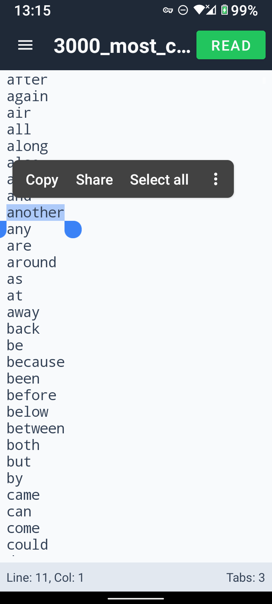
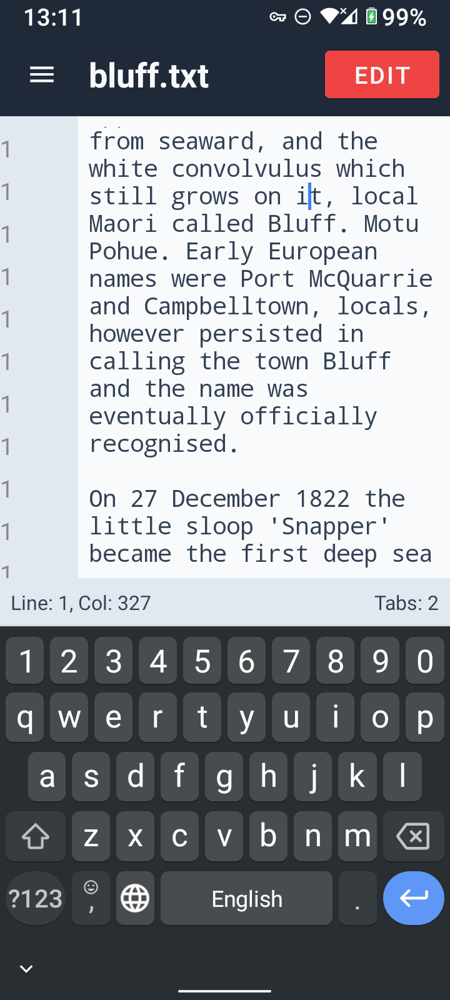
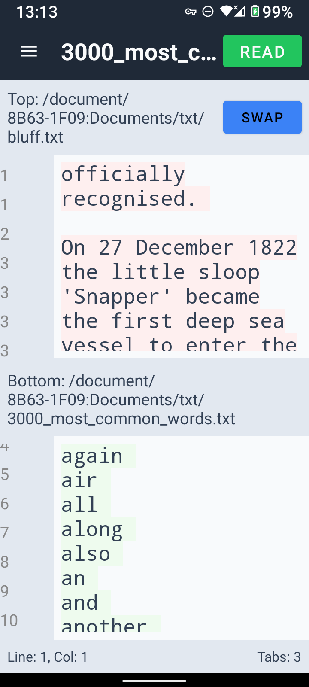

# Simple Android Text Editor

A professional-grade, lightweight text editor for Android designed for developers and power users. Built with Jetpack Compose, this application provides a robust environment for reading and editing text files with a focus on productivity and stability.

## About
The Simple Android Text Editor is a modern Android application that leverages the Storage Access Framework (SAF) to provide secure and flexible access to the device's file system. It aims to provide a "desktop-like" editing experience on a mobile device, featuring multi-tab management, split-screen editing, and advanced file comparison tools.

## Features
- **SAF Integration**: Full integration with Android's Storage Access Framework for seamless opening and saving of files from any supported location.
- **Dual Editing Modes**: 
  - **Read Mode**: Optimized for viewing, preventing accidental edits.
  
  - **Edit Mode**: Full text editing capabilities.
  
  - *Safety Feature*: The app blocks transitions from Edit to Read mode if the file contains unsaved changes (dirty state).
- **Advanced View Modes**:
  - **Horizontal Split View**: Two editors displayed vertically, allowing for simultaneous viewing or editing of two different files.
  - **Diff View**: A vertical, two-row comparison tool that highlights additions and deletions between two files using a custom diffing algorithm.
  
- **Tab Management**:
  - Support for multiple open files.
  - **Quick Cycle**: Horizontal swipe gestures to quickly switch between open tabs in a continuous loop.
- **Customizable Typography**:
  - **Pinch-to-Zoom**: Intuitive pinch gestures to adjust font size dynamically.
  - **Font Range**: Supports a professional range from 8sp to 72sp.

## How to Build and Install

### Using Android Studio (Recommended)
1. **Prerequisites**: 
   - Android Studio (latest stable version recommended).
   - JDK 11 or higher.
2. **Import**: Open Android Studio and select `File -> Open...` and choose the root directory of the project.
3. **Gradle Sync**: Allow Android Studio to sync the Gradle files.
4. **Run**: Select a device or emulator (Android 11+ / API 30+) and click the **Run** button.

### Using Command Line (Docker / SDK Environment)
1. **Prerequisites**:
   - Android SDK installed and `ANDROID_HOME` environment variable set.
   - Gradle installed on the system.
2. **Build the APK**:
   Navigate to the project root and run:
   ```bash
   gradle build
   ```
   *Note: If building specifically for a debug APK, you can use `gradle assembleDebug`.*
3. **Locate the APK**:
   The resulting APK will be located at:
   `/app/app/build/outputs/apk/debug/app-debug.apk`
4. **Install to Device**:
   ```bash
   adb install app/build/outputs/apk/debug/app-debug.apk
   ```

## Usage Guide
- **Navigation**: Use the hamburger menu (top-left) to access file opening, split view toggles, and diff mode.
- **Tab Switching**: Swipe horizontally across the editor area to cycle through your open files.
- **Mode Switching**: Use the status bar or menu to toggle between Read and Edit modes. Note that you must save your changes before switching back to Read mode.
- **Zooming**: Use a two-finger pinch gesture anywhere in the text area to increase or decrease the font size.
- **Comparison**: Enable Diff View from the menu, select two files, and view the highlighted differences.

## Technical Specs
- **Target Platform**: Android 11+ (API Level 30+).
- **UI Framework**: Jetpack Compose (Modern declarative UI).
- **Architecture**: MVVM (Model-View-ViewModel) for clear separation of concerns and state management.
- **Language**: Kotlin.
- **State Management**: Compose `mutableStateListOf` and `derivedStateOf` for efficient UI updates.
